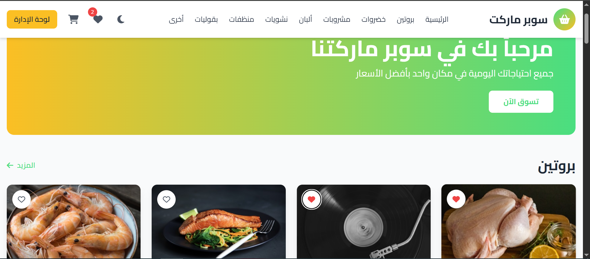
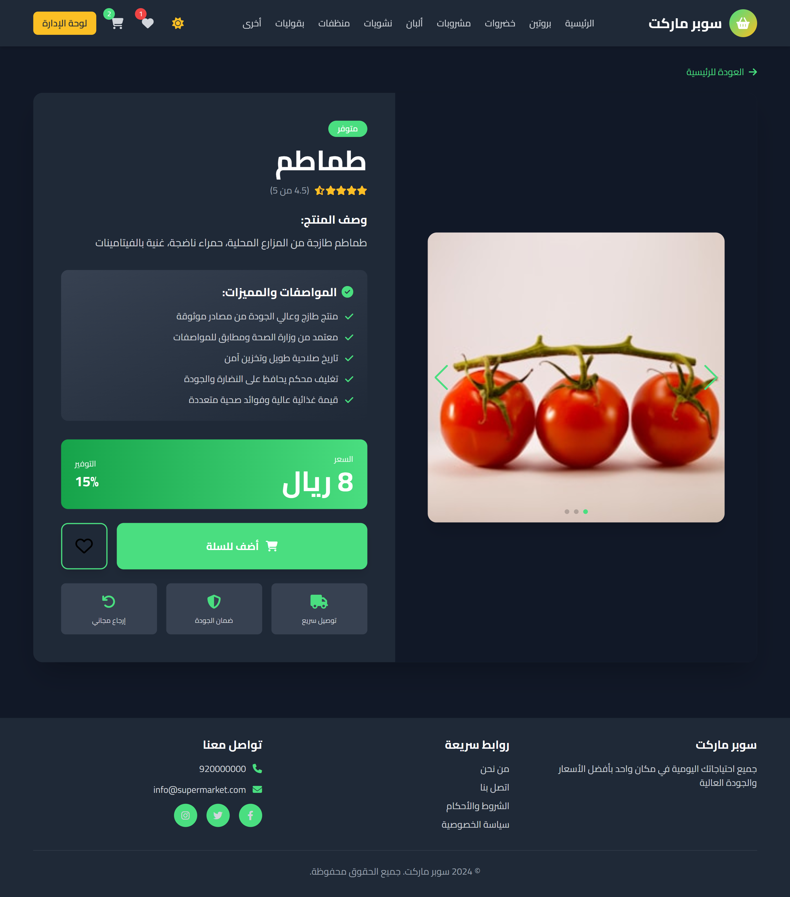
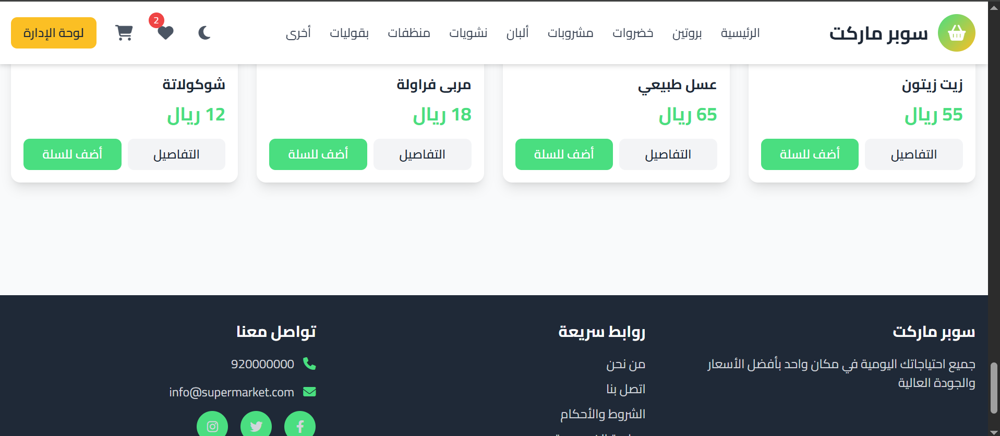
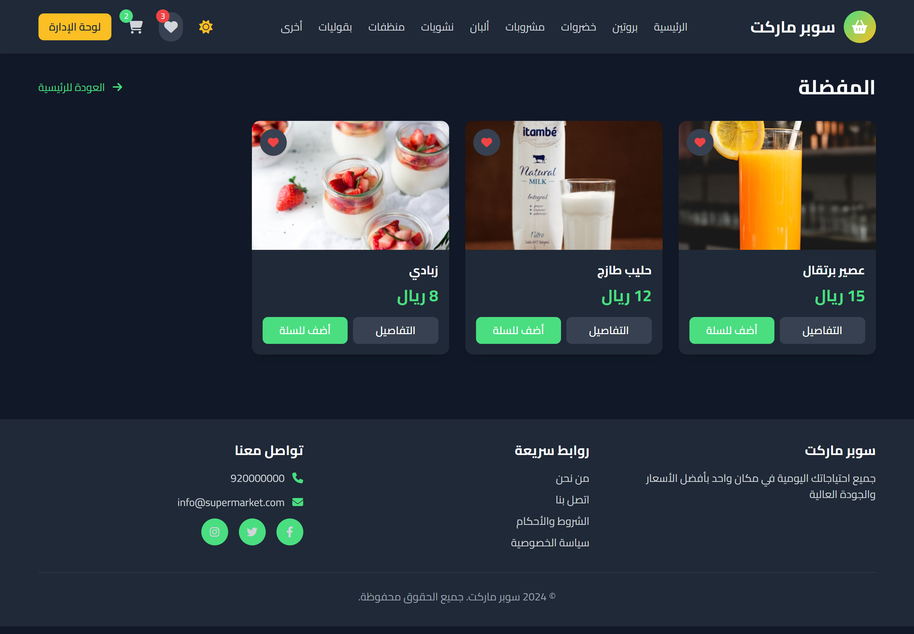
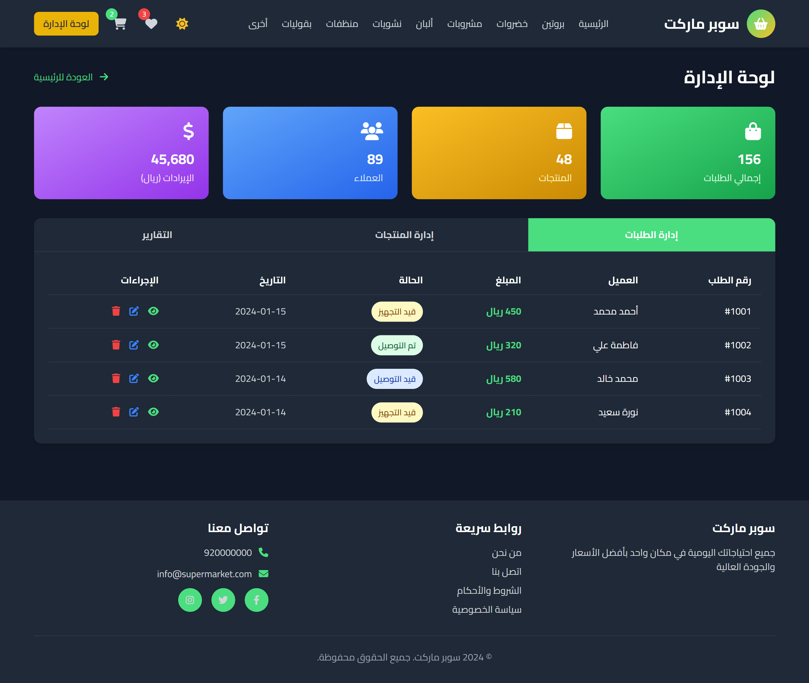
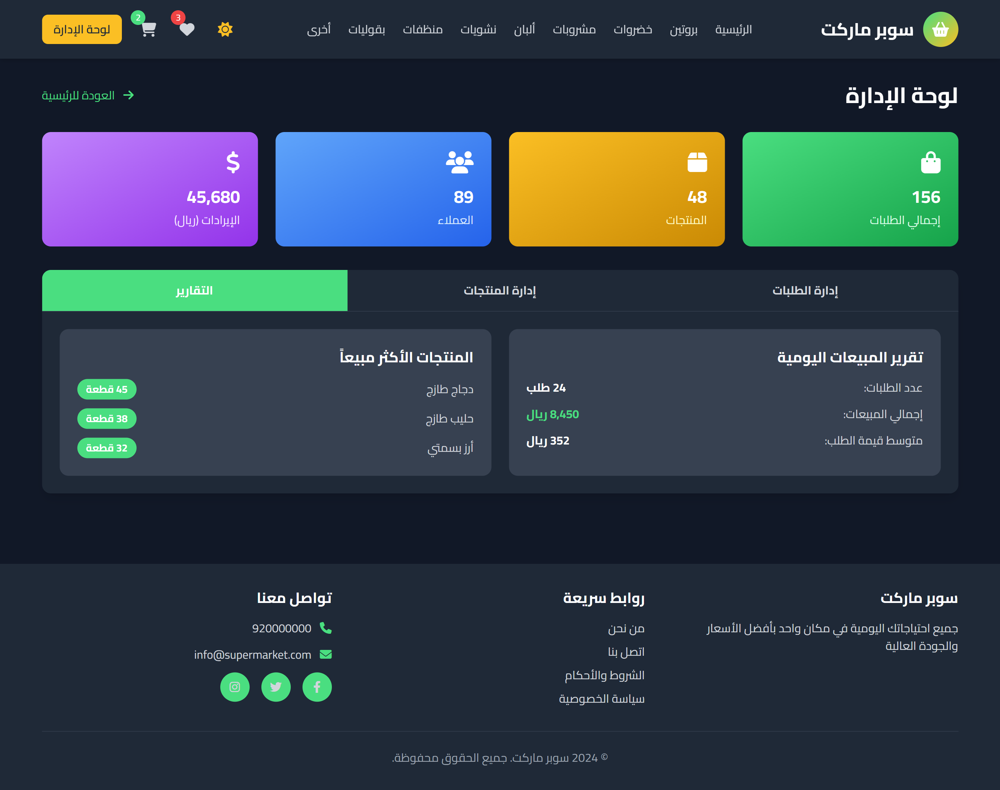
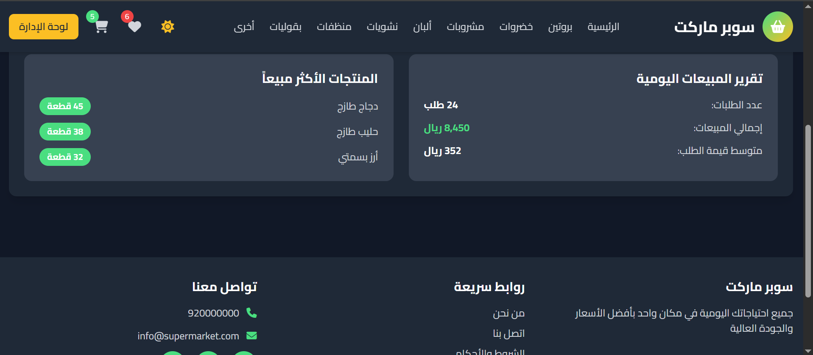

# 🛒 Supermarket Online Shop

A modern, fully-featured online supermarket shopping application built with HTML, CSS, and JavaScript. This project provides a complete e-commerce experience with multiple product categories, shopping cart functionality, favorites, and an admin panel.

---

## 📋 Table of Contents

- [Project Overview](#project-overview)
- [Live Demo](#live-demo)
- [Project Structure](#project-structure)
- [Features](#features)
- [Technologies Used](#technologies-used)
- [File Structure](#file-structure)
- [Product Screenshots](#product-screenshots)
- [Project Video](#project-video)
- [Portfolio](#portfolio)

---

## 🎯 Project Overview

**Supermarket** is a responsive e-commerce web application designed to provide users with an intuitive shopping experience. The platform allows customers to browse various product categories, add items to their cart, save favorites, and experience a seamless checkout process. The application includes a complete admin panel for managing products and inventory.

### Key Highlights:
- ✨ Modern, responsive design that works on all devices
- 🌙 Dark/Light mode toggle for better user experience
- 🛍️ Multi-category product browsing (8+ categories)
- ❤️ Favorites system to save preferred items
- 🛒 Functional shopping cart with quantity management
- 👨‍💼 Admin panel for product management
- 📱 Mobile-first approach with Tailwind CSS
- 🌐 RTL (Right-to-Left) support for Arabic language
- ⚡ Fast performance with Alpine.js reactivity

---

## 🌐 Live Demo

Experience the live application here:

**[Supermarket Online Shop Demo](https://supermarket-online-shop.vercel.app/)**

Click the link above to access the fully functional online supermarket platform!

---

## 📁 Project Structure

```
Supermarket/
├── index.html          # Main HTML file (1028 lines)
├── script.js           # JavaScript application logic (190 lines)
├── styles.css          # Custom CSS styles
├── Supermarket.mp4     # Project demonstration video
├── s1.jpg              # Product category screenshot 1
├── s2.jpg              # Product category screenshot 2
├── s3.jpg              # Product category screenshot 3
├── s4.jpg              # Product category screenshot 4
├── s5.jpg              # Product category screenshot 5
├── s6.jpg              # Product category screenshot 6
├── s7.jpg              # Product category screenshot 7
├── s8.jpg              # Product category screenshot 8
├── s9.jpg              # Product category screenshot 9
└── README.md           # This file
```

---

## ✨ Features

### 1. **Multi-Category Shopping**
   - **Protein** (دجاج - Chicken, لحم - Meat, سمك - Fish, etc.)
   - **Vegetables** (طماطم - Tomatoes, خيار - Cucumber, خس - Lettuce, etc.)
   - **Drinks** (عصائر - Juices, مياه - Water, المشروبات الغازية - Soft Drinks)
   - **Dairy Products** (حليب - Milk, جبنة - Cheese, زبادي - Yogurt)
   - **Carbohydrates** (أرز - Rice, معكرونة - Pasta, خبز - Bread)
   - **Cleaning Products** (منظفات - Cleaners, معطرات - Fresheners)
   - **Legumes** (عدس - Lentils, حمص - Chickpeas, فول - Beans)
   - **Other Products** (زيت زيتون - Olive Oil, عسل - Honey, etc.)

### 2. **Shopping Cart Management**
   - Add/remove products
   - Adjust quantity
   - Real-time price calculation
   - Cart persistence
   - Clear cart option

### 3. **Favorites System**
   - Save favorite products
   - Quick access to bookmarked items
   - Favorites counter badge

### 4. **User Interface**
   - Modern gradient design with primary green and secondary yellow colors
   - Smooth animations and transitions
   - Responsive layout for mobile, tablet, and desktop
   - Sticky header for easy navigation
   - Mobile hamburger menu
   - Dark/Light theme toggle

### 5. **Admin Panel**
   - Product management
   - Inventory control
   - Price updates
   - Product addition/deletion
   - Sales analytics

### 6. **Additional Features**
   - RTL (Arabic) language support
   - Search functionality
   - Product filtering by category
   - Product details modal
   - Cart summary

---

## 🛠️ Technologies Used

### Frontend Framework & Libraries:
- **HTML5** - Semantic markup and structure
- **CSS3** - Styling with Tailwind CSS
- **JavaScript (ES6+)** - Interactive functionality
- **[Tailwind CSS](https://tailwindcss.com/)** - Utility-first CSS framework
- **[Alpine.js](https://alpinejs.dev/)** - Lightweight reactive framework
- **[Swiper.js](https://swiperjs.com/)** - Touch slider library
- **[Font Awesome](https://fontawesome.com/)** - Icon library
- **[Google Fonts (Cairo)](https://fonts.google.com/)** - Arabic-optimized font family

### Design Principles:
- Mobile-first responsive design
- Accessibility (a11y) best practices
- Semantic HTML structure
- CSS Grid and Flexbox layouts
- Component-based architecture

---

## 📄 File Structure & Details

### **index.html** (1028 lines)
The main HTML file containing:
- Header with navigation and branding
- Hero banner section
- Product categories display
- Shopping cart page
- Favorites page
- Admin panel interface
- Footer
- Meta tags for responsiveness and SEO
- CDN links for Tailwind, Alpine.js, Swiper, and Font Awesome

**Key Sections:**
```
├── Header (Navigation & User Actions)
│   ├── Logo and branding
│   ├── Desktop navigation menu
│   ├── Dark mode toggle
│   ├── Favorites button
│   ├── Shopping cart button
│   ├── Admin panel button
│   └── Mobile menu toggle
│
├── Main Content Area
│   ├── Home page (hero section)
│   ├── Category pages (8 different categories)
│   ├── Product grid with cards
│   ├── Shopping cart page
│   ├── Favorites page
│   ├── Admin panel
│   └── Product detail modal
│
└── Footer
    ├── Copyright information
    ├── Social links
    ├── Quick links
    └── Contact information
```

### **script.js** (190 lines)
JavaScript application logic including:

1. **Tailwind Configuration**
   - Custom color theme (Primary: #4ade80, Secondary: #fbbf24)
   - Cairo font family setup
   - Dark mode configuration

2. **Alpine.js App Factory**
   ```javascript
   window.app = function() {
       return {
           // Application state
           darkMode: boolean,
           cartCount: number,
           favCount: number,
           cart: array,
           favorites: array,
           
           // Product database
           products: {
               protein: [...],
               vegetables: [...],
               drinks: [...],
               dairy: [...],
               carbs: [...],
               cleaners: [...],
               legumes: [...],
               others: [...]
           },
           
           // Methods
           addToCart(),
           removeFromCart(),
           toggleFavorite(),
           viewCategory(),
           // ... more methods
       }
   }
   ```

3. **Product Management**
   - 48 products across 8 categories
   - Each product has: id, name, price, image, description
   - Category filtering logic
   - Product search functionality

4. **State Management**
   - Cart state management
   - Favorites tracking
   - UI state (dark mode, mobile menu, current page)
   - Real-time counter updates

### **styles.css** (Custom Styles)
Custom CSS enhancements including:
- Font configuration (Cairo font family)
- Swiper slider styling
- Custom color overrides
- Animation effects
- X-cloak directive (Alpine.js)

---

## 📸 Product Screenshots

The following screenshots showcase different sections and features of the Supermarket application:
### Screenshot 1: Main Interface










---

## 🎬 Project Video

Watch the complete project demonstration and features walkthrough:

**[Download Video: Supermarket.mp4](Supermarket.mp4)**

This video showcases:
- Application interface and layout
- Product browsing functionality
- Shopping cart operations
- Favorites management
- Dark/Light mode switching
- Admin panel features
- Mobile responsiveness
- Complete user workflow

---

## 💼 Portfolio

Check out more of my projects and work:

**[Mohamed Abdelmajeed's Portfolio](https://mohamed-abdelmajeed-portfolio.vercel.app/)**

This Supermarket project is also featured in my portfolio website. Visit the link above to explore:
- More completed projects
- Technical skills and expertise
- About me section
- Contact information
- Resume/CV

---

## 🚀 Getting Started

### Prerequisites:
- Web browser (Chrome, Firefox, Safari, Edge)
- Internet connection for CDN resources

### Installation:
1. Clone or download this project
2. Navigate to the project folder
3. Open `index.html` in your web browser
4. Start shopping!

### Local Development:
```bash
# If you want to serve locally using Python 3
python -m http.server 8000

# Or using Node.js http-server
npx http-server

# Then visit: http://localhost:8000
```

---

## 📊 Product Categories & Count

| Category | Arabic | Product Count |
|----------|--------|---------------|
| Protein | بروتين | 6 |
| Vegetables | خضروات | 6 |
| Drinks | مشروبات | 6 |
| Dairy | ألبان | 6 |
| Carbohydrates | نشويات | 6 |
| Cleaning | منظفات | 6 |
| Legumes | بقوليات | 6 |
| Others | أخرى | 6+ |
| **TOTAL** | | **~48+** |

---

## 🎨 Color Scheme

- **Primary Color**: #4ade80 (Green) - Used for main actions and buttons
- **Secondary Color**: #fbbf24 (Yellow/Amber) - Used for highlights and accents
- **Background**: #ffffff (Light) / #111827 (Dark)
- **Text**: #1f2937 (Light mode) / #f3f4f6 (Dark mode)

---

## 🔧 Customization

### To modify colors:
Edit the color values in `script.js`:
```javascript
colors: {
    'primary': '#4ade80',      // Change primary color
    'secondary': '#fbbf24',    // Change secondary color
}
```

### To add new products:
Add product objects to the relevant category in `script.js`:
```javascript
products: {
    protein: [
        { 
            id: 1, 
            name: 'Product Name', 
            price: 50, 
            image: 'image-url', 
            desc: 'Product description' 
        }
    ]
}
```

### To add new categories:
1. Add category to `categoryNames` object
2. Add category array to `products` object
3. Add navigation link in HTML header

---

## 📱 Responsive Design

The application is fully responsive and optimized for:
- **Mobile**: 320px - 640px (Phones)
- **Tablet**: 641px - 1024px (Tablets)
- **Desktop**: 1025px+ (Desktops & Large screens)

Breakpoints used:
- `sm:` (640px)
- `md:` (768px)
- `lg:` (1024px)
- `xl:` (1280px)

---

## ♿ Accessibility Features

- Semantic HTML structure
- ARIA labels for screen readers
- Keyboard navigation support
- High contrast dark mode option
- Focus indicators on interactive elements
- Alt text for images
- Proper heading hierarchy

---

## 🐛 Known Issues & Future Improvements

### Planned Features:
- [ ] User authentication and login system
- [ ] Order history and tracking
- [ ] Payment gateway integration
- [ ] Product reviews and ratings
- [ ] Wishlist sharing functionality
- [ ] Email notifications
- [ ] Multi-language support (English/Arabic)
- [ ] Advanced search filters
- [ ] Analytics dashboard for admin

### Performance Optimizations:
- [ ] Image lazy loading
- [ ] Service Worker for offline support
- [ ] Caching strategy
- [ ] Code splitting
- [ ] Minification

---

## 📝 License

This project is open source and available for personal and educational use.

---

## 👨‍💻 Developer

**Mohamed Abdelmajeed**

- Portfolio: [https://mohamed-abdelmajeed-portfolio.vercel.app/](https://mohamed-abdelmajeed-portfolio.vercel.app/)
- Project Demo: [https://supermarket-online-shop.vercel.app/](https://supermarket-online-shop.vercel.app/)
- Email: your-email@example.com
- LinkedIn: [Your LinkedIn Profile]
- GitHub: [Your GitHub Profile]

---

## 🙏 Acknowledgments

- Tailwind CSS for the amazing utility-first CSS framework
- Alpine.js for reactive functionality
- Swiper.js for smooth slider experience
- Font Awesome for beautiful icons
- Unsplash for free product images
- The amazing developer community for inspiration and support

---

## 📞 Support & Contact

If you have any questions or need support:
- Visit the [Portfolio](https://mohamed-abdelmajeed-portfolio.vercel.app/)
- Check the [Live Demo](https://supermarket-online-shop.vercel.app/)
- Create an issue in the repository
- Contact via email

---

## 🎓 Learning Resources

This project demonstrates:
- **Frontend Development**: HTML5, CSS3, JavaScript ES6+
- **Responsive Design**: Mobile-first approach, Flexbox, Grid
- **Modern Frameworks**: Alpine.js, Tailwind CSS
- **State Management**: Client-side state with Alpine.js
- **E-commerce Logic**: Cart management, favorites, product filtering
- **User Interface**: Dark mode, animations, transitions
- **Code Organization**: Component-based architecture

---

**Last Updated**: January 2026

**Status**: ✅ Active & Maintained

---

*Made with ❤️ by Mohamed Abdelmajeed*
